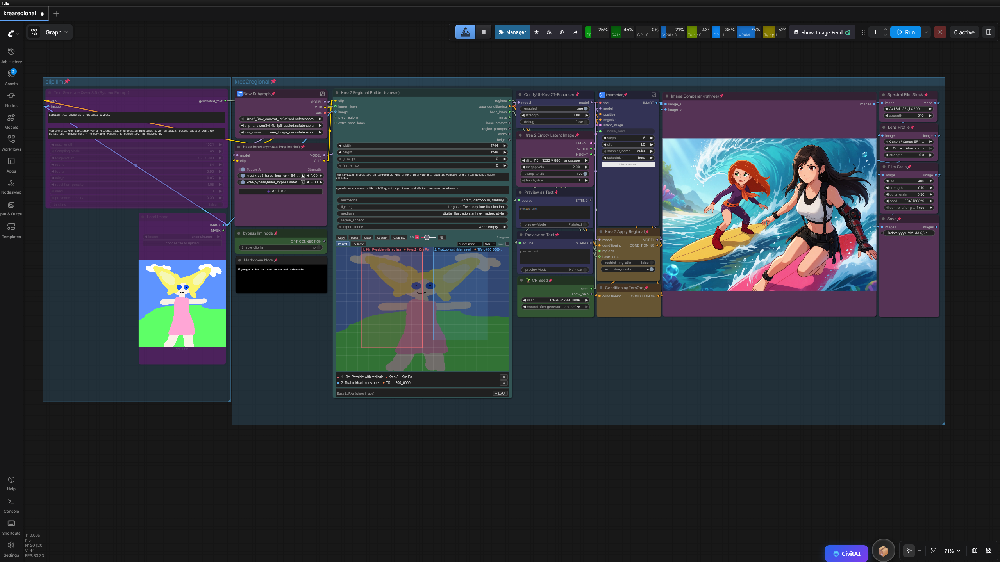

# ComfyUI-Krea2-Regional

Regional prompting and **per-region LoRA** for [Krea 2](https://github.com/krea-ai/krea-2)
(K2) in ComfyUI — draw regions on a canvas, give each its own prompt and
LoRAs, and generate in a **single pass**.


Krea 2 is a single-stream MMDiT: text and image tokens share every attention
op. This pack exploits that to do regional generation in **one model pass per
step** instead of the usual N-passes-and-blend approach:

- **Regional prompts** — all prompts are concatenated into one text sequence;
  a joint attention mask keeps each region's image tokens attending only to
  their own prompt (plus a shared base prompt for scene coherence).
- **Regional LoRA** — LoRA deltas are gated per token, so a LoRA only acts
  inside its region's mask. This works without breaking ComfyUI's own LoRA
  weight-patching, so global LoRAs stack on top.

The result is fast (one pass, not N) with soft, coherent seams; the trade-off
is some LoRA/style bleed at boundaries, which several options control.



## Install

Clone into `ComfyUI/custom_nodes/` and restart:

```bash
cd ComfyUI/custom_nodes
git clone https://github.com/januspluto/ComfyUI-Krea2-Regional.git
```

Requires a ComfyUI build with native Krea 2 support (v0.26+). No extra Python
dependencies beyond what ComfyUI already ships.

## Quick start

The fastest path is the all-in-one canvas node:

1. Add **Krea2 Regional Builder (canvas)**. Wire your Krea2 `CLIP` into it.
2. Draw regions on the canvas, type each region's prompt, pick per-region
   LoRAs from the searchable dropdown.
3. Wire its `regions`, `base_conditioning`, and `base_loras` outputs into
   **Krea2 Apply Regional**, along with your `MODEL`.
4. Wire Apply Regional's `MODEL` -> KSampler, and its `CONDITIONING` ->
   KSampler positive.

Optionally wire an image captioner (see below) into the builder's
`import_json` and hit the **Caption** button to auto-populate regions from an
image — without running a full generation.

## Nodes

**Krea2 Regional Builder (canvas)** — the main event. A canvas editor with
rect + freehand-lasso region tools, per-region prompts, obj/text region
types, searchable per-region LoRA dropdowns with a trained-tag info panel,
base description/background/style fields, grid/snap/guides, a live reference
background (from a wired image or the Grab BG button), a pop-out editor
window, and a Caption button that runs only a connected captioner.

**Krea2 Apply Regional** — patches the model for single-pass regional
generation. Options: `restrict_img_attn` (block cross-region image attention)
and `exclusive_masks` (winner-take-all where masks overlap). Takes the
builder's outputs; returns a patched `MODEL` and combined `CONDITIONING`.

**Krea 2 Empty Latent Image** — an rgthree-style empty latent sized for
Krea 2's Qwen-Image VAE (16-channel, /16 dims, 1K–2K native range).
Aspect-ratio buckets + a megapixels dial; outputs the LATENT plus WIDTH/
HEIGHT ints that wire straight into the builder.

**Krea2 Regional LoRA** / **Krea2 Regional Prompt** — lower-level building
blocks if you'd rather compose regions from node chains than use the canvas.

**Krea2 Regions from Ideogram JSON** *(optional)* — a headless bridge that
turns an Ideogram-4 caption JSON into regions with no canvas. The builder
supersedes it (it imports the same JSON via `import_json` and lets you edit
the result), so most users can ignore this; it's kept for no-UI pipelines.

## Captioning an image into regions

Any node whose text output is an Ideogram-style layout JSON can feed the
builder's `import_json`. The recommended setup uses the Qwen3.5 VL text
encoder you already load for Krea 2 (no extra model): see
[`qwen_captioner_prompt.txt`](qwen_captioner_prompt.txt) for the system
prompt and wiring. Hit **Caption** on the builder to run just that node and
import its output — no Krea2 sampling.

## Controlling LoRA / subject bleed

In order of impact:

1. **Keep subjects out of the base prompt.** The base prompt is shared by
   every image token, so if it names subjects ("a knight and a wizard"), the
   model tries to render them everywhere — the main cause of subjects
   drifting between regions. Describe the scene generically in the base;
   keep each subject's identity only in its region prompt.
2. **`exclusive_masks`** (Apply Regional, default on) — where grown/feathered
   masks overlap, each token keeps only its strongest region.
3. **`restrict_img_attn`** (Apply Regional) — blocks image-to-image attention
   across regions. Strongest lever; can look collaged at hard seams.
4. **Keep `grow_px`/`feather_px` small** for tightly packed layouts (at
   1024px each latent token is 16px), and leave gutters between boxes.

Some soft bleed through the shared base prompt is inherent to single-pass
regional attention — it's also what keeps seams coherent. For absolute
separation, ComfyUI's native ConditioningSetMask multi-pass approach remains
an option at N-times the step cost.

## LoRA formats

Per-region and base LoRAs load from your `models/loras` folder. Both PEFT/
diffusers (`lora_A`/`lora_B`) and kohya (`lora_down`/`lora_up` + `alpha`) key
styles are matched against Krea 2's `blocks.*` and `txtfusion.*` layers.
Regular `LoraLoader`/Power Lora Loader weight patches stack on top cleanly.
If a checkpoint logs unmatched keys, open an issue with a few key names.

## Tests

CPU tests run against ComfyUI's real Krea 2 module. From the repo folder:

```bash
COMFYUI_PATH=/path/to/ComfyUI python test_nodes.py    # regional core
COMFYUI_PATH=/path/to/ComfyUI python test_bridge.py   # ideogram bridge
COMFYUI_PATH=/path/to/ComfyUI python test_builder.py  # canvas builder
python test_server_routes.py                          # lora metadata reader
```

`COMFYUI_PATH` defaults to `~/ComfyUI` if unset. See
[`CONTRIBUTING.md`](CONTRIBUTING.md).

## How it works

Detailed notes on the single-stream attention masking, per-token LoRA
gating, and the run-level caching that avoids per-step allocation churn live
in [`docs/ARCHITECTURE.md`](docs/ARCHITECTURE.md).

## License

MIT — see [LICENSE](LICENSE). Not affiliated with Krea or Anthropic.
