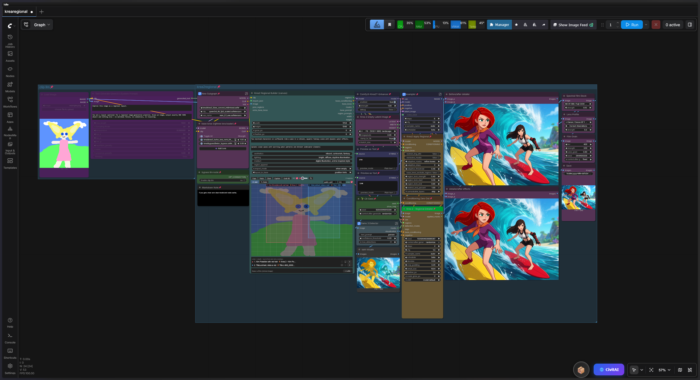

# ComfyUI-Krea2-Regional

Regional prompting and **per-region LoRA** for [Krea 2](https://github.com/krea-ai/krea-2)
(K2) in ComfyUI — draw regions on a canvas, give each its own prompt and
LoRAs, and generate in a **single pass**.




Krea 2 is a single-stream MMDiT: text and image tokens share every attention
op. This pack exploits that to do regional generation in **one model pass per
step** instead of the usual N-passes-and-blend approach:

- **Regional prompts** — all prompts are concatenated into one text sequence;
  a joint attention mask keeps each region's image tokens attending only to
  their own prompt (plus a shared base prompt for scene coherence).
- **Regional LoRA** — LoRA deltas are gated per token, so a LoRA only acts
  inside its region's mask. This works without breaking ComfyUI's own LoRA
  weight-patching, so global LoRAs stack on top.

The result is fast (one pass, not N) with soft, coherent seams; the trade-off
is some LoRA/style bleed at boundaries, which several options control.

## Install

Clone into `ComfyUI/custom_nodes/` and restart:

```bash
cd ComfyUI/custom_nodes
git clone https://github.com/januspluto/ComfyUI-Krea2-Regional.git
```

Requires a ComfyUI build with native Krea 2 support (v0.26+). No extra Python
dependencies beyond what ComfyUI already ships.

## Quick start

The fastest path is the all-in-one canvas node:

1. Add **Krea2 Regional Builder (canvas)**. Wire your Krea2 `CLIP` into it.
2. Draw regions on the canvas, type each region's prompt, pick per-region
   LoRAs from the searchable dropdown.
3. Wire its `regions`, `base_conditioning`, and `base_loras` outputs into
   **Krea2 Apply Regional**, along with your `MODEL`.
4. Wire Apply Regional's `MODEL` -> KSampler, and its `CONDITIONING` ->
   KSampler positive.

Optionally wire an image captioner (see below) into the builder's
`import_json` and hit the **Caption** button to auto-populate regions from an
image — without running a full generation.

An example workflow is in [`example_workflows/`](example_workflows/) — drag the `.json` onto the ComfyUI canvas to load it.

## Nodes

**Krea2 Regional Builder (canvas)** — the main event. A canvas editor with
rect + freehand-lasso region tools, per-region prompts, obj/text region
types, searchable per-region LoRA dropdowns with a trained-tag info panel,
base description/background/style fields, grid/snap/guides, a live reference
background (from a wired image or the Grab BG button), a pop-out editor
window, and a Caption button that runs only a connected captioner.
Lassos are fully editable pen-tool style: drag vertices, press-drag an edge
midpoint to split it, alt-click a vertex to delete it, and scale the whole
shape by its bounding-box handles; any region converts rect ↔ lasso with
one button. The region list doubles as **front-to-back depth** — reorder
with the ↑/↓ buttons; the top region wins where masks overlap.

**Krea2 Apply Regional** — patches the model for single-pass regional
generation. Options: `adaptive_masks` (FreeFuse-style: snap masks to the
subjects the model actually draws), `restrict_img_attn` (block cross-region
image attention) with `restrict_end_percent` scheduling, `exclusive_masks`
(winner-take-all where masks overlap; exact ties go to the front region),
`region_lock_*` (latent identity anchoring), `base_loras_exclude_regions`,
and `unmaskable_layers` (policy for LoRA layers with no spatial token axis
— timestep/modulation embedders from newer trainers: "skip" keeps them out
of region LoRAs, "apply globally" keeps their full effect image-wide).
Takes the builder's outputs; returns a patched `MODEL` and combined
`CONDITIONING`.

**Krea 2 - Regional Detailer** — optional second pass that fixes identity
bleed and likeness *after* generation. See
[Regional Detailer](#regional-detailer-second-pass-identity-fix) below.

**Krea 2 Empty Latent Image** — an rgthree-style empty latent sized for
Krea 2's Qwen-Image VAE (16-channel, /16 dims, 1K–2K native range).
Aspect-ratio buckets + a megapixels dial; outputs the LATENT plus WIDTH/
HEIGHT ints that wire straight into the builder.

**Krea2 Regional LoRA** / **Krea2 Regional Prompt** — lower-level building
blocks if you'd rather compose regions from node chains than use the canvas.

**Krea2 Regions from Ideogram JSON** *(optional)* — a headless bridge that
turns an Ideogram-4 caption JSON into regions with no canvas. The builder
supersedes it (it imports the same JSON via `import_json` and lets you edit
the result), so most users can ignore this; it's kept for no-UI pipelines.

## Captioning an image into regions

Any node whose text output is an Ideogram-style layout JSON can feed the
builder's `import_json`. The recommended setup uses the Qwen3.5 VL text
encoder you already load for Krea 2 (no extra model): see
[`qwen_captioner_prompt.txt`](qwen_captioner_prompt.txt) for the system
prompt and wiring. Hit **Caption** on the builder to run just that node and
import its output — no Krea2 sampling.

## Controlling LoRA / subject bleed

In order of impact:

1. **`adaptive_masks`** (Apply Regional) — FreeFuse-style adaptive routing
   ([arXiv:2510.23515](https://arxiv.org/abs/2510.23515)): during the first
   couple of steps the wrapper watches the attention between each region's
   prompt tokens and the image tokens — i.e. where the model *actually*
   placed each subject — then snaps the region masks to those silhouettes
   for the remaining steps. "refine boxes" keeps discovery inside your
   (slightly grown) boxes, so rectangles become rough hints and the LoRA
   follows the subject's real shape; "free" lets regions land anywhere and
   your boxes only seed the prompts.
2. **`layout_in_base`** (Builder, default "position hints") — Krea 2's
   Qwen3-VL encoder reads positional and structured prompts as layout
   guidance, so the builder injects each region's placement into the base
   prompt ("in the left side of the image, prominent: an armored knight…"),
   or the whole layout as an Ideogram-style JSON in "full JSON" mode. This
   steers WHERE the model composes each subject; the attention masks handle
   isolation and LoRA routing. Without it, the base prompt carries no
   positional signal and the masks fight whatever composition the model
   picks — the classic "subjects don't line up with the boxes" failure.
   Note this supersedes the old "keep subjects out of the base" rule:
   *anchored* subject mentions (with positions) help; only *un-anchored*
   enumeration ("a knight and a wizard") causes drift.
3. **`exclusive_masks`** (Apply Regional, default on) — where grown/feathered
   masks overlap, each token keeps only its strongest region.
4. **`restrict_img_attn`** (Apply Regional) — blocks image-to-image attention
   across regions. Strongest lever; can look collaged at hard seams. Pair it
   with **`restrict_end_percent`** (~0.4-0.6) to get both: hard isolation
   while each subject's identity forms, then an open second half where the
   model integrates seams and lighting into one cohesive image.
5. **`base_loras_exclude_regions`** (Apply Regional) — style/base LoRAs
   apply everywhere *except* inside subject regions, so a style LoRA can
   skin the scene without contaminating character LoRAs.
6. **Keep `grow_px`/`feather_px` small** for tightly packed layouts (at
   1024px each latent token is 16px), and leave gutters between boxes.

Some soft bleed through the shared base prompt is inherent to single-pass
regional attention — it's also what keeps seams coherent. For absolute
separation, ComfyUI's native ConditioningSetMask multi-pass approach remains
an option at N-times the step cost.

## Regional Detailer (second-pass identity fix)

When subjects drift out of their boxes or a character's likeness gets
diluted where masks overlap, **Krea 2 - Regional Detailer** repairs it
after the fact: it finds where each subject *actually* landed, re-samples
just that subject at high resolution with its region's prompt and LoRAs at
full (ungated) strength, and composites it back through the subject's own
silhouette — so a neighbour's arm inside the box is never repainted with
the wrong identity.

Wiring, after your KSampler → VAE Decode:

1. Run the decoded image through any subject detector — SAM3 (prompt
   "person") or Impact Pack's Ultralytics person/face detectors both work.
2. Wire the image, the detector's masks into `detection_masks` (or its
   SEGS into `segs`), your **base** `MODEL` (not Apply Regional's output),
   your `VAE`, and the Builder's `regions` and `base_conditioning` (the
   Builder's own output, not Apply Regional's combined conditioning).
3. Detections are matched to regions by overlap, with a bounded
   nearest-centre rescue for subjects that drifted out of their box.
   Unmatched regions are left untouched.

Settings that matter: `denoise` 0.2–0.3 (0.25 default) tightens likeness
while keeping pose; 0.35+ starts recomposing inside the silhouette. Keep
`shift` on "model default" — Krea 2 **Turbo** is distilled at a fixed mu
and must inherit the first pass's schedule; the per-crop "auto" mode is
for **RAW** only. Fewer `steps` (4–6) is often smoother than 8 for a
partial-denoise pass. With no detector connected the node falls back to
cropping by the region boxes themselves — fine for well-separated
subjects, bleed-prone when they overlap, so prefer detection mode for
multi-character images.

## Compatibility notes

- Requires a ComfyUI build with native Krea 2 support (v0.26+); the 1.2.0
  release is tested against ComfyUI 0.29–0.30.
- The canvas builder targets ComfyUI's standard graph renderer. If the
  canvas misrenders under the experimental "Nodes 2.0" rendering mode, try
  disabling that setting (several DOM-widget-heavy node packs are
  affected).
- Video VAEs (WanVAE) are supported end to end, including in the Detailer.

## LoRA formats

Per-region and base LoRAs load from your `models/loras` folder. PEFT/
diffusers (`lora_A`/`lora_B`), kohya (`lora_down`/`lora_up` + `alpha`), and
**LoKr** (Kronecker: `lokr_w1`/`lokr_w2`, direct or a@b-factorized — what
recent ai-toolkit builds output) are all matched against Krea 2's `blocks.*`
and `txtfusion.*` layers; tucker/conv LoKr variants are skipped with a
warning. Tip: a region-masked LoRA has to establish its identity in a
fraction of the image — strengths around 1.3–1.6 often work better than the
~1.0 you'd use globally.
Regular `LoraLoader`/Power Lora Loader weight patches stack on top cleanly.
If a checkpoint logs unmatched keys, open an issue with a few key names.

## Tests

CPU tests run against ComfyUI's real Krea 2 module. From the repo folder:

```bash
COMFYUI_PATH=/path/to/ComfyUI python test_nodes.py    # regional core
COMFYUI_PATH=/path/to/ComfyUI python test_bridge.py   # ideogram bridge
COMFYUI_PATH=/path/to/ComfyUI python test_builder.py  # canvas builder
python test_server_routes.py                          # lora metadata reader
```

`COMFYUI_PATH` defaults to `~/ComfyUI` if unset. See
[`CONTRIBUTING.md`](CONTRIBUTING.md).

## How it works

Detailed notes on the single-stream attention masking, per-token LoRA
gating, and the run-level caching that avoids per-step allocation churn live
in [`docs/ARCHITECTURE.md`](docs/ARCHITECTURE.md).

## License

MIT — see [LICENSE](LICENSE). Not affiliated with Krea or Anthropic.
